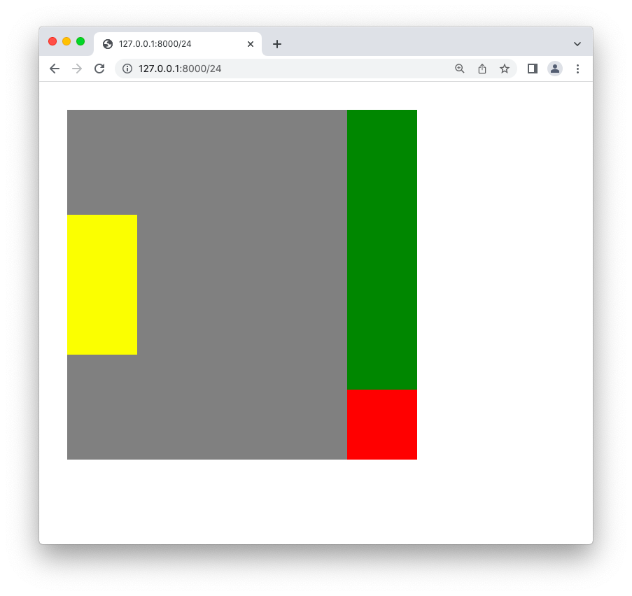
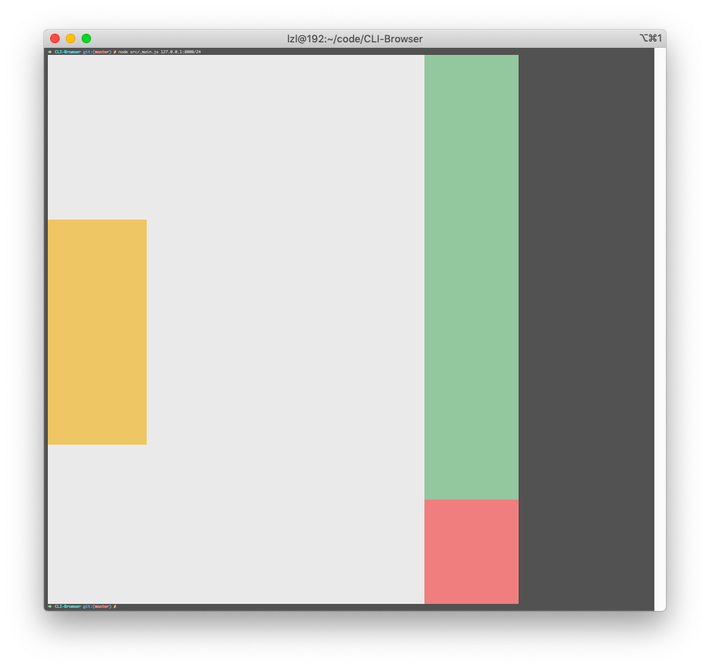

# CLI-Browser

一个在命令行渲染的小型网页浏览器.

[English version](./README.md)

## 介绍
这是一个用原生 JavaScript 实现的小型网页浏览器 (它的运行时是 Node.js, 没有依赖任何第三方库).  
它包括了: HTTP 库, HTML 解析器, CSS 解析器, 排版引擎, 渲染引擎.  
但最特别的地方在于, 它将页面渲染在了命令行.

## 实现原理
1. 通过 HTTP 协议获取 `HTML` 内容. (HttpRequest.js, ResponseParser.js, ResponseBodyParser.js)
2. 解析 HTML, 构建 `DOM 树`. (HtmlParser.js)
3. 解析和匹配 CSS, 构建 `具有 CSS 的 DOM`. (CssParser.js, CssComputer.js)
4. 排版, 构建 `具有位置的 DOM `. (Layouter.js)
5. 渲染和绘制. (Render.js)

特别地, 页面被渲染在了命令行, 这是怎么实现的 ?  
`渲染(Rendering)` 的意思是将 DOM 树转换成位图 (bitmap, 是内存里建立的一张二维表格, 保存每个像素).  
`绘制(Drawing)` 是把位图绘制到肉眼可见的屏幕上的过程.  

简而言之, 我们如何在命令行中显示一堆像素 ?  
答案是 `ANSI 转义字符` (它可以控制每个字符在命令行中的颜色),  
所以我使用有颜色的方形空白字符(\u3000)来表示每一个像素,  
最终, 页面被渲染成一堆有颜色的方形空白字符.

## 用法
1. `git clone https://github.com/devlzl/CLI-Browser.git`
2. `cd CLI-Browser`
3. 运行 `node test/server.js`, 在 `/test` 目录下有 27 个测试用例.
4. 你可以首先看到测试用例在真实的浏览器中是如何渲染的. 例如, 用 chrome 访问 `http://127.0.0.1:8000/24` 可以看到 `test24.html` 的内容.
5. 然后打开另一个命令行 (推荐 iTerm2), 多按几次 "command -" 以缩小它的字体, 然后拖动将窗口变大 (因为每个字符作为一个像素, 它应该尽可能的小, 而为了显示更多的"像素", 窗口应该尽可能的大). 然后运行 `node src/_main.js 127.0.0.1:8000/24` 去查看 `test24.html` 在命令行中的样子 !

## 截图
在 Google Chrome 中的效果:  

在 iTerm2 中的效果:  

